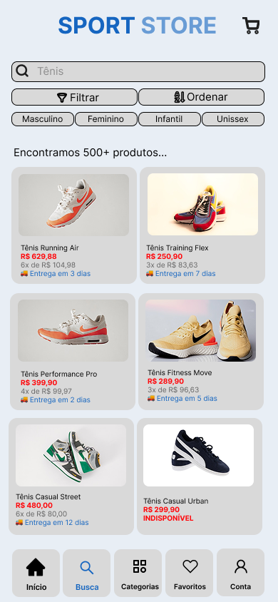
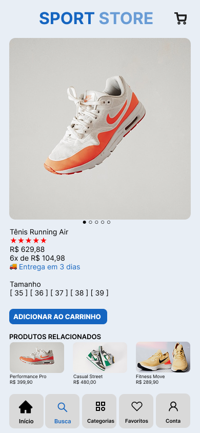
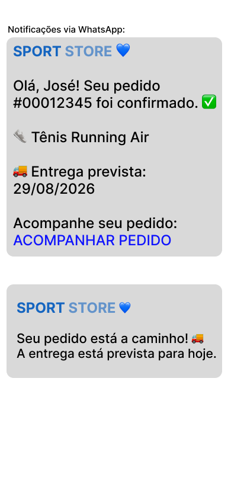
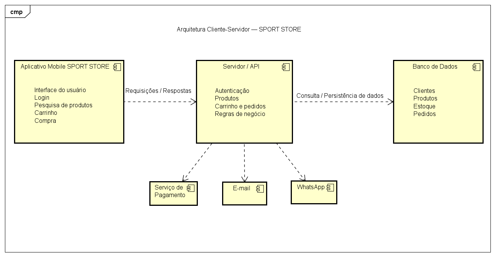

# 🏃 Sport Store

Protótipo de aplicativo mobile para um **e-commerce de produtos esportivos**, desenvolvido como projeto acadêmico da disciplina de **Engenharia de Software** do curso de **Análise e Desenvolvimento de Sistemas — PUCRS**.

O projeto contempla etapas de análise de requisitos, definição do processo de desenvolvimento, elaboração de User Stories e critérios de aceite, prototipação de alta fidelidade e definição da arquitetura da solução.

---

## 📱 Sobre o projeto

A **Sport Store** foi projetada como uma aplicação mobile de comércio eletrônico voltada à venda de produtos esportivos.

A solução permite ao usuário pesquisar e visualizar produtos, consultar prazos de entrega, gerenciar o carrinho de compras, selecionar formas de pagamento e acompanhar o andamento de seus pedidos.

Durante a criação das interfaces, buscou-se desenvolver uma experiência de navegação **simples, intuitiva e de fácil utilização**.

---

## 🎯 Objetivos do projeto

O desenvolvimento da Sport Store permitiu aplicar na prática conceitos de Engenharia de Software, incluindo:

- Análise e especificação de requisitos
- Requisitos funcionais e não funcionais
- User Stories
- Critérios de aceite
- Processo de desenvolvimento incremental
- UX e usabilidade
- Prototipação de alta fidelidade
- Arquitetura Cliente-Servidor

---

## 🔄 Processo de desenvolvimento

Para o projeto foi adotado um **processo adaptativo utilizando o modelo incremental**.

Esse modelo possibilita desenvolver e validar o sistema gradualmente, permitindo incorporar mudanças, identificar problemas mais cedo e reduzir o risco de desenvolver funcionalidades que não atendam às necessidades do usuário.

---

## 📋 Principais requisitos funcionais

Entre as funcionalidades especificadas para a Sport Store estão:

- Autenticação por login e senha
- Pesquisa de produtos
- Visualização do prazo de entrega
- Exibição de produtos relacionados
- Identificação de produtos indisponíveis
- Acesso e gerenciamento do carrinho de compras
- Pagamento por cartão de crédito, débito e PIX
- Confirmação e atualização do pedido por e-mail
- Notificação via WhatsApp quando o pedido sair para entrega

---

## 🎨 Protótipo de alta fidelidade

As interfaces foram desenvolvidas no **Figma**, representando o principal fluxo de utilização da aplicação.

### 🔐 Login

  

### 🏠 Home

  

### 🔎 Resultado da pesquisa

  

### 👟 Detalhes do produto

  

### 🛒 Carrinho de compras

  

### 💳 Pagamento

  

### 📱 Pagamento via PIX

  

### ✅ Confirmação do pedido

  

---

## 🔔 Comunicação com o cliente

O projeto também prevê notificações para manter o cliente informado sobre o andamento da compra.

### WhatsApp

  

### E-mail

  

---

## 🏗️ Arquitetura da solução

Para estruturar a Sport Store foi definida a arquitetura **Cliente-Servidor**.

O aplicativo mobile representa o cliente, sendo responsável pela interface e interação com o usuário. As solicitações são enviadas ao servidor, responsável pelo processamento das regras de negócio e pelo acesso aos dados da aplicação.

O servidor também pode realizar integrações com serviços externos, como sistemas de pagamento, envio de e-mails e notificações via WhatsApp.

  

---

## 🛠️ Ferramentas e conceitos utilizados

- Figma
- Engenharia de Software
- Engenharia de Requisitos
- User Stories
- Critérios de Aceite
- UX/UI
- Prototipação de alta fidelidade
- Modelo Incremental
- Arquitetura Cliente-Servidor

---

## 🎓 Contexto acadêmico

Projeto desenvolvido para a disciplina de **Engenharia de Software** do curso de **Análise e Desenvolvimento de Sistemas da PUCRS**.

O trabalho contemplou desde a definição do processo de desenvolvimento e levantamento dos requisitos até a criação do protótipo de alta fidelidade e a definição da arquitetura da solução.

---

## 👩‍💻 Autora

**Susi da Rosa**

Estudante de Análise e Desenvolvimento de Sistemas — PUCRS
